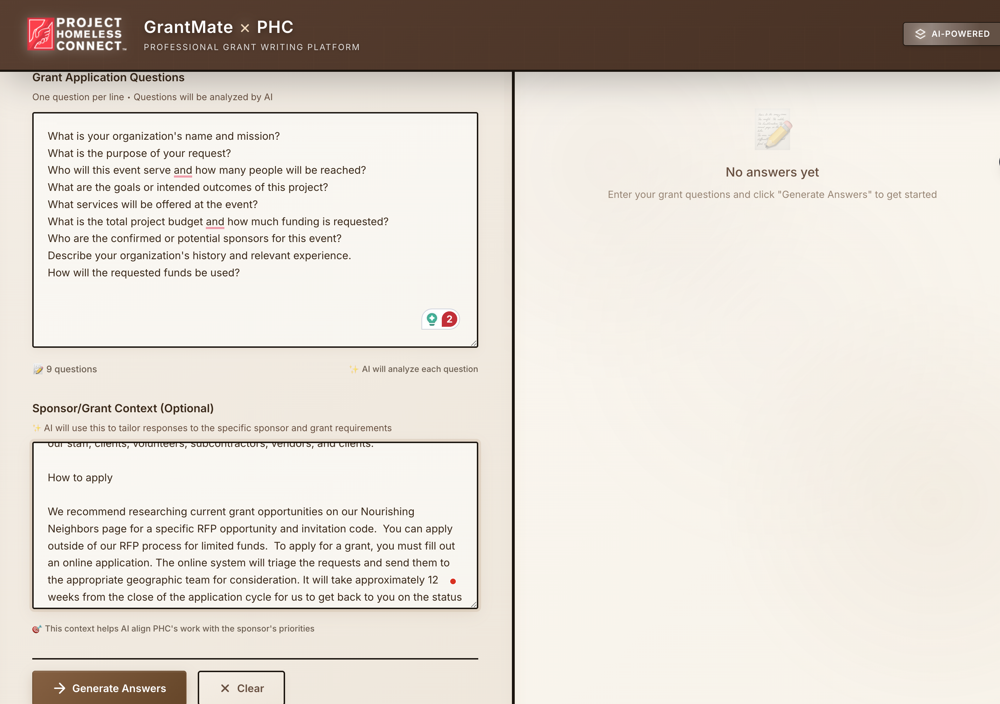
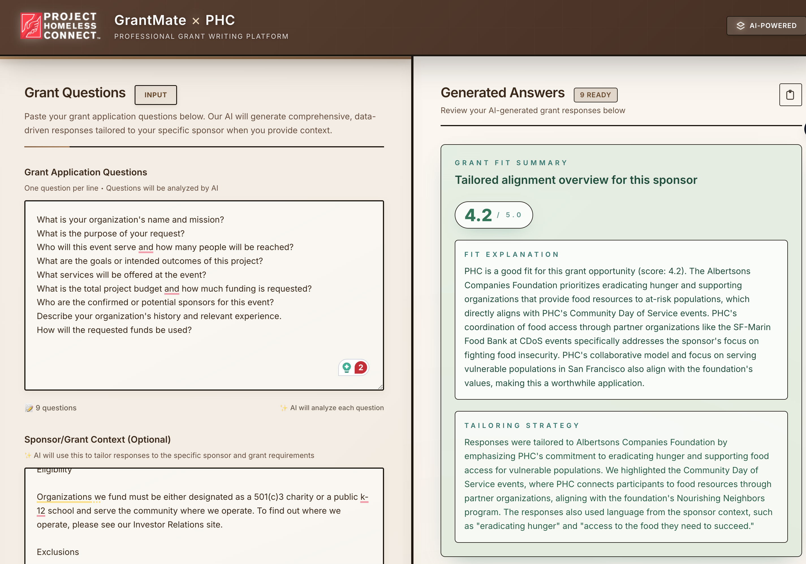
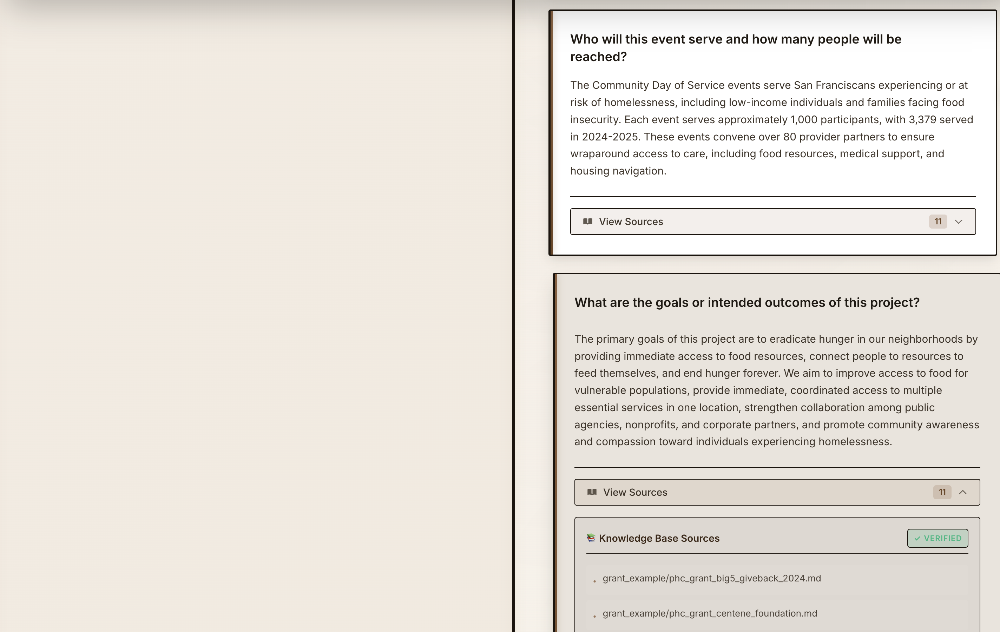
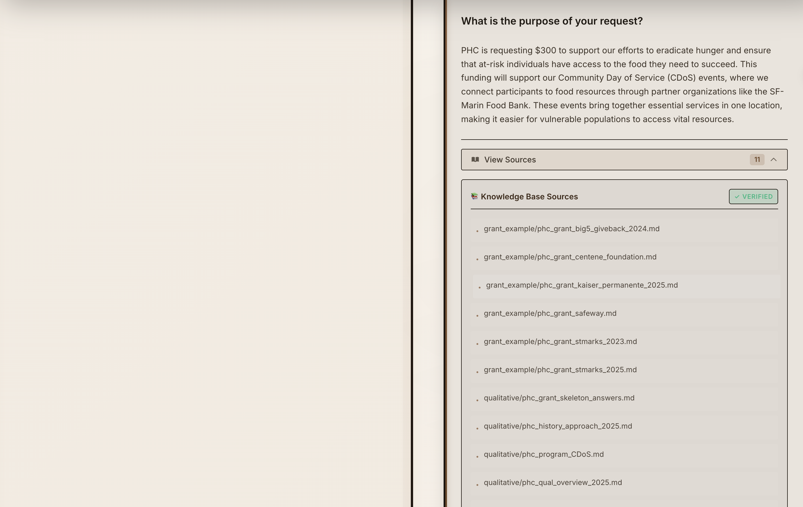

# GrantMate 🤝

> **AI-Powered Grant Writing Assistant for Nonprofits**  
> Built for Project Homeless Connect at Hack for Social Impact 2025



<div align="center">

[](https://choosealicense.com/licenses/mit/)
[](https://www.python.org/downloads/)
[](https://reactjs.org/)
[](https://fastapi.tiangolo.com/)
[](https://ai.google.dev/)

[Demo](#demo) • [Features](#features) • [Tech Stack](#tech-stack) • [Setup](#quick-start) • [Team](#team)

</div>

---

## 📖 The Problem

Project Homeless Connect (PHC), a San Francisco nonprofit serving 15,000+ individuals experiencing homelessness annually, faces a critical funding challenge. As public grants become increasingly competitive, they need to apply to more private foundations to sustain operations.

### The Real Challenge

**Grant applications take significant time to complete** - often a week or more per application. For a small nonprofit that needs to submit multiple grants per year, this creates real problems:

- 📝 **Complex requirements** - Applications are lengthy with specific formatting
- 🎯 **Sponsor-specific tailoring** - Each funder has unique priorities and language
- 📊 **Data gathering** - Statistics and impact stories are scattered across documents
- ⏰ **Staff capacity** - Time spent writing grants means less time serving the community

This project addresses a real problem: helping nonprofits write grant applications more efficiently without sacrificing quality.

---

## 💡 Our Solution

**GrantMate** uses Retrieval-Augmented Generation (RAG) and Google's Gemini AI to transform grant writing from a week-long ordeal into a streamlined, intelligent process.



### How It Works

1. **📤 Input** - Paste grant questions and optional sponsor context
2. **🔍 Semantic Search** - Vector embeddings find the most relevant organizational data
3. **🤖 AI Generation** - Gemini crafts compelling, tailored responses citing real data
4. **✅ Quality Assurance** - Built-in guardrails ensure accuracy and truthfulness
5. **📋 Export** - Copy polished answers directly into applications

### What Makes It Different

GrantMate is built specifically for grant writing with several key features:

- ✅ **Grounded in verified data** - Uses only documented organizational information
- ✅ **Source attribution** - Cites knowledge base sources for transparency
- ✅ **Sponsor analysis** - Helps tailor responses to specific funders
- ✅ **Honest assessment** - Provides fit scores that acknowledge both strengths and gaps
- ✅ **Real feedback** - Built based on conversations with PHC staff about actual needs

---

## ✨ Features

### 🎨 Beautiful, Intuitive Interface

A clean, modern React UI built with accessibility and user experience in mind.

- Split-pane design for easy comparison
- Real-time generation with loading states
- One-click copy to clipboard
- Responsive design for any device
- Toast notifications for user feedback

### 🚀 Intelligent Response Generation

**Every response includes:**
- **Question** - Original grant question
- **Answer** - Comprehensive, grant-ready response
- **Sources** - Transparent citations from knowledge base

**When sponsor context is provided:**
- **Tailoring Explanation** - How we optimized for this specific funder
- **Fit Score** (0-5.0) - Honest assessment of organizational alignment
- **Fit Explanation** - Why this score, what aligns, what doesn't

### 🎯 Sponsor-Aware Tailoring

Provide information about the grant sponsor, and GrantMate will:
- Extract key priorities and requirements
- Emphasize relevant programs and statistics
- Use sponsor terminology and framing
- Identify alignment gaps honestly
- Explain the optimization strategy

**Example:**
> *"Responses emphasized PHC's health service coordination and used terminology like 'health equity' that aligns with the sponsor's stated priorities."*

### 🛡️ Truth Guardrails

Built-in safeguards to maintain accuracy:

- 🔒 **Knowledge base only** - Responses use documented organizational information
- 🔍 **Source tracking** - All statistics come from verified documents
- ⚖️ **Precise language** - Distinguishes between services directly provided vs coordinated
- 🚫 **No invention** - Won't claim capabilities not in the knowledge base
- 💰 **Financial discretion** - Avoids disclosing potentially sensitive funding information

### ⚡ Performance Optimizations

**Smart Caching:**
- Vector embeddings cached to disk for faster subsequent loads
- Helps reduce startup time after first run
- Automatically updates when knowledge base changes

**Batched Operations:**
- Processes multiple questions in a single API call
- Reduces API quota usage
- More efficient for multi-question applications

### 📊 Comprehensive Knowledge Base

Organized repository of organizational data:

- **Quantitative** - Impact metrics, participant counts, service statistics
- **Qualitative** - Programs, history, approach, partnerships
- **Grant Examples** - Past successful applications
- **Contact** - Leadership and governance information

**Priority-weighted retrieval** ensures the most relevant data surfaces first.

---

## 🏗️ Tech Stack

We leveraged modern technologies to build a production-ready system:

### Backend

| Technology | Purpose | Why We Chose It |
|------------|---------|-----------------|
| **Python 3.11** | Runtime | Type hints, performance improvements |
| **FastAPI** | Web Framework | Async support, automatic API docs, type validation |
| **Pydantic** | Data Validation | Type-safe request/response models |
| **Google Gemini 2.0 Flash** | Large Language Model | Best-in-class reasoning, 1M token context window |
| **text-embedding-004** | Vector Embeddings | State-of-art semantic search, 768 dimensions |
| **NumPy** | Vector Operations | Efficient similarity calculations |
| **Uvicorn** | ASGI Server | Production-grade async server |

### Frontend

| Technology | Purpose | Why We Chose It |
|------------|---------|-----------------|
| **React 19** | UI Framework | Latest features, improved performance |
| **TypeScript** | Type Safety | Catch errors at compile time |
| **Vite** | Build Tool | Lightning-fast HMR, optimized builds |
| **Tailwind CSS 4** | Styling | Rapid UI development, modern design system |

### AI/ML Architecture

| Component | Technology | Purpose |
|-----------|------------|---------|
| **RAG System** | Custom implementation | Retrieval-Augmented Generation pipeline |
| **Vector Store** | In-memory NumPy arrays | Fast similarity search |
| **Embeddings Cache** | Pickle serialization | Persistent storage, fast cold starts |
| **Semantic Search** | Cosine similarity | Relevance ranking with priority weighting |
| **Prompt Engineering** | Custom multi-level prompts | Grant-specific instruction tuning |

### Infrastructure & DevOps

| Tool | Purpose |
|------|---------|
| **Docker** | Containerization for consistent deployments |
| **Git** | Version control and collaboration |
| **GitHub** | Code hosting and project management |

### APIs & Services

| Service | Usage |
|---------|-------|
| **Google Gemini API** | LLM inference and embeddings |
| **FastAPI Auto Docs** | Interactive API testing (Swagger/ReDoc) |

---

## 🎯 Key Technical Achievements

### 1. Advanced RAG Implementation

```python
# Semantic search with priority weighting
def search(self, query: str, top_k: int = 10) -> List[Dict]:
    query_embedding = embed_query(query)
    similarities = []
    
    for i, chunk_embedding in enumerate(self.embeddings):
        similarity = cosine_similarity(query_embedding, chunk_embedding)
        # Boost quantitative data for grant writing
        boosted_score = similarity * (1 + self.chunks[i]['priority'] * 0.1)
        similarities.append((boosted_score, i))
    
    return top_chunks(similarities, top_k)
```

**Smart chunk prioritization:**
- Quantitative data (priority 4.0) - statistics first
- Qualitative info (priority 3.0) - programs and approach
- Grant examples (priority 2.0) - reference material
- Contact info (priority 1.0) - only when needed

### 2. Sophisticated Prompt Engineering

**1,372-line prompt** with:
- Role definition (senior grant writer with 20+ years experience)
- Writing quality standards (robust, compelling, data-driven)
- Financial confidentiality rules (never disclose past fundraising)
- Truth guardrails (only verified capabilities)
- Response length guidelines (adaptive based on question complexity)
- Sponsor tailoring instructions (when context provided)
- Examples for every pattern (heavy questions, simple questions, budget questions)

### 3. Intelligent Caching Strategy

```python
# MD5-based cache invalidation
def _get_cache_path(self) -> Path:
    content_hash = hashlib.md5()
    for chunk in sorted(self.chunks, key=lambda x: x['path']):
        content_hash.update(chunk['path'].encode())
        content_hash.update(chunk['content'].encode())
    
    return self.cache_dir / f"embeddings_{content_hash.hexdigest()}.pkl"
```

**Benefits:**
- ✅ Automatic invalidation when knowledge base changes
- ✅ Persistent across server restarts
- ✅ Reduced API calls by >90% after first run

### 4. Robust Error Handling

- Input validation with Pydantic
- Graceful API quota handling
- Fallback to keyword search if embeddings fail
- Comprehensive error messages
- Logging for debugging

---

## 📸 Screenshots

### Sponsor Tailoring & Fit Analysis

*When sponsor context is provided, GrantMate explains how it tailored responses, provides an honest fit score, and explains the alignment - this is where the magic happens!*

### Main Interface

*Clean split-pane design - paste questions on the left, get AI-generated answers on the right*

### Generated Results with Source Citations

*Every answer includes comprehensive responses with transparent source citations from the knowledge base*

---

## 🚀 Quick Start

> **Note:** This is a showcase repository. See [SHOWCASE_NOTICE.md](SHOWCASE_NOTICE.md) for full context.

### Prerequisites

- Python 3.11+
- Node.js 18+
- Google Gemini API key ([Get one free](https://makersuite.google.com/app/apikey))

### Installation

```bash
# Clone repository
git clone https://github.com/YOUR_USERNAME/GrantMate.git
cd GrantMate

# Install Python dependencies
pip install -r requirements.txt

# Install Node dependencies
npm install
```

### Configuration

```bash
# Create environment file
echo "GEMINI_API_KEY=your-api-key-here" > .env
```

### Run

```bash
# Quick start (both backend + frontend)
chmod +x run_local.sh
./run_local.sh

# Or run separately:
# Backend: uvicorn main:app --reload
# Frontend: npm run dev
```

### Access

- **Frontend:** http://localhost:8080
- **Backend API:** http://localhost:8000
- **API Docs:** http://localhost:8000/docs

---

## 💡 Potential Impact

### Expected Time Savings

While exact metrics will vary by organization and grant complexity, GrantMate aims to significantly reduce time spent on:

- **Data gathering** - Automated retrieval from knowledge base instead of manual searching
- **First draft generation** - Quick initial responses that staff can refine
- **Sponsor research** - Automated analysis of alignment with funder priorities
- **Source tracking** - Automatic citations eliminate manual documentation

**Note:** This is still a prototype built during a hackathon. Real-world impact would need to be measured through actual deployment and user feedback. The goal is to give nonprofit staff a helpful starting point, not replace their expertise.

---

## 🔮 Future Enhancements

We have ambitious plans to expand GrantMate's capabilities:

### 1. 🗄️ Integrated Grant Database

**Problem:** PHC spends significant time just *finding* relevant grants.

**Solution:** Build a comprehensive grant database with:
- Automated web scraping of foundation websites
- Grant eligibility matching based on organizational profile
- Deadline tracking and reminders
- Submission status management
- Historical success rate tracking

**Technical Approach:**
- PostgreSQL database with full-text search
- Scheduled scrapers for major grant platforms (Foundation Directory, Candid, etc.)
- ML-based eligibility scoring using organization characteristics
- Calendar integration for deadline management

### 2. 🔄 End-to-End Grant Workflow

**Integrate database with current system:**

```
[Grant Discovery] → [Eligibility Assessment] → [Application Generation] → [Submission Tracking]
      ↓                      ↓                           ↓                        ↓
  Database           Fit Scoring                  GrantMate               Status Dashboard
```

**Features:**
- One-click from "Found grant" to "Generated application"
- Automatic fit scoring before investing time
- Priority queue based on deadlines and fit scores
- Post-submission tracking and follow-ups

### 3. 🧠 Enhanced AI Capabilities

- Iterative refinement based on user feedback
- Budget generation assistance
- Letter of inquiry support
- Multiple foundation profile management
- Alternative response generation

### 4. 📈 Analytics & Learning

- Track which approaches work well
- Identify knowledge base gaps
- Learn from successful applications

### 5. 🤝 Multi-Organization Support

Potential to expand beyond PHC:
- Support for multiple organizations
- Customizable knowledge bases
- Shared learnings (with privacy)

---

## 🎯 Project Goals

### The Motivation

This project addresses a real challenge facing nonprofits: the significant time investment required for grant writing. While it's a hackathon project built over a weekend, it demonstrates how AI tools could potentially help organizations be more efficient without replacing the human expertise and relationships that are essential to fundraising.

### What We Built

This project showcases:
- **RAG implementation** - Retrieval-augmented generation for grounded responses
- **Prompt engineering** - Careful instruction design to maintain accuracy
- **Full-stack development** - FastAPI backend with React frontend
- **Real-world application** - Built based on actual nonprofit needs
- **Responsible AI practices** - Guardrails, source attribution, honest limitations

### Potential Applications

If further developed and tested, tools like this could help nonprofits with their grant writing workflow. However, this remains a prototype that would need real-world validation, user testing, and significant refinement before being truly useful in production.

---

## 👥 Team

<table>
  <tr>
    <td align="center">
      <br />
      <sub><b>Joseph Le</b></sub><br />
      <a href="https://github.com/JosephLeKH">@JosephLeKH</a><br />
      <sub>Full Stack • AI/ML</sub>
    </td>
    <td align="center">
      <br />
      <sub><b>Jadelyn Tran</b></sub><br />
      <a href="https://github.com/jadelyntran">@jadelyntran</a><br />
      <sub>Full Stack • AI/ML</sub>
    </td>
  </tr>
</table>

**Built at Hack for Social Impact 2025**

### Our Contributions

- **Architecture & Backend** - FastAPI, RAG system, prompt engineering
- **Frontend & UI/UX** - React, TypeScript, Tailwind design
- **AI/ML** - Vector embeddings, semantic search, caching
- **Product** - User research with PHC, feature prioritization
- **DevOps** - Deployment, documentation, security

---

## 📄 License

This project is licensed under the MIT License - see the [LICENSE](LICENSE) file for details.

## 🙏 Acknowledgments

- **Project Homeless Connect** - For sharing their challenges and providing feedback
- **Hack for Social Impact** - For organizing the hackathon
- **Google** - For providing Gemini API access

---

## 📞 Contact

Have questions or want to contribute? Open an issue or reach out!

---

<div align="center">

**A hackathon project exploring AI applications for nonprofit grant writing**

</div>

